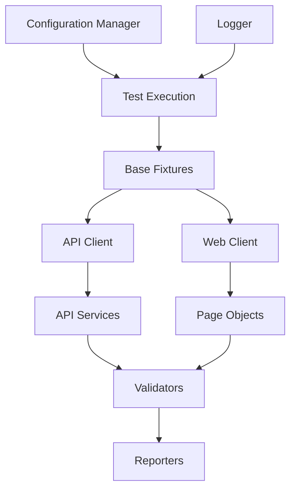

# TestFusion Enterprise 🚀

**Enterprise-Grade Test Automation Framework**

A comprehensive, production-ready test automation framework built with
Playwright and TypeScript, designed for both API and web application testing at
scale.

[](https://github.com/TestFusion-Enterprise/TestFusion-Enterprise/actions)
[](https://www.typescriptlang.org/)
[](https://playwright.dev/)
[](https://nodejs.org/)
[](LICENSE)

---

## 📋 Table of Contents

- [Features](#-features)
- [Architecture](#-architecture)
- [Prerequisites](#-prerequisites)
- [Quick Start](#-quick-start)
- [Configuration](#-configuration)
- [Running Tests](#-running-tests)
- [Project Structure](#-project-structure)
- [Test Development](#-test-development)
- [Reporting](#-reporting)
- [CI/CD Integration](#-cicd-integration)
- [Best Practices](#-best-practices)
- [Troubleshooting](#-troubleshooting)
- [Contributing](#-contributing)

---

## ✨ Features

### 🎯 Core Testing Capabilities

| Feature                   | Description                                              |
| ------------------------- | -------------------------------------------------------- |
| **Dual Testing Modes**    | Complete support for both API and Web UI testing         |
| **Cross-browser Testing** | Chromium, Firefox, WebKit, Edge support                  |
| **Mobile Testing**        | iOS Safari and Android Chrome device emulation           |
| **Parallel Execution**    | Intelligent parallel execution with configurable workers |
| **Cloud Testing**         | BrowserStack and Selenium Grid integration ready         |
| **Performance Testing**   | Built-in performance monitoring and metrics              |

### 🏗️ Professional Architecture

- **🔧 Centralized Fixtures**: Base fixture pattern eliminates code duplication
- **📄 Page Object Model**: Organized, maintainable test structure
- **🔷 TypeScript First**: Full TypeScript support with strict mode
- **🧩 Modular Design**: Clean separation of concerns and reusable components
- **📊 Professional Logging**: Structured logging with correlation IDs

### 📊 Enterprise Reporting

- **📈 Multi-format Reports**: HTML, JUnit, JSON, and Qase.io integration
- **🎥 Visual Evidence**: Screenshots, videos, and execution traces
- **📋 Test Management**: Professional test case management integration
- **⚡ Performance Metrics**: Response time tracking and performance dashboards
- **🔍 Health Monitoring**: Comprehensive system health checks

### 🔧 Developer Experience

- **✅ Code Quality**: ESLint, Prettier, TypeScript strict mode
- **🪝 Git Hooks**: Pre-commit hooks for quality enforcement
- **📝 Conventional Commits**: Structured commit message format
- **🔒 Security**: Built-in security scanning and vulnerability detection
- **🐳 Docker Support**: Containerized testing environment

### 🚀 DevOps & CI/CD

- **🔄 GitHub Actions**: Complete CI/CD pipeline with matrix testing
- **📦 Dependency Management**: Automated updates with Renovate
- **🔐 Environment Security**: Encrypted environment variable management
- **🏷️ Release Automation**: Semantic versioning and automated releases

---

## 🏛️ Architecture



### Design Patterns

- **Factory Pattern**: Browser provider factory for different execution
  environments
- **Strategy Pattern**: Configurable execution strategies (local, grid, cloud)
- **Page Object Model**: Encapsulated page interactions and elements
- **Fixture Pattern**: Centralized test setup and teardown
- **Builder Pattern**: Configurable test data generation

---

## 📋 Prerequisites

| Requirement | Version  | Purpose                            |
| ----------- | -------- | ---------------------------------- |
| **Node.js** | 18.19.0+ | Runtime environment (see `.nvmrc`) |
| **npm**     | 9.0.0+   | Package management                 |
| **Git**     | Latest   | Version control                    |
| **Docker**  | Latest   | Optional: Containerized testing    |

### System Requirements

- **Memory**: 4GB+ RAM (8GB recommended for parallel execution)
- **Storage**: 2GB+ free space for browser installations and reports
- **OS**: Windows 10+, macOS 10.15+, Ubuntu 18.04+

---

## 🛠️ Quick Start

### 1. Installation

```bash
# Clone the repository
git clone <repository-url>
cd TestFusion-Enterprise

# Install dependencies and setup browsers
npm install
npx playwright install
```

### 2. Environment Setup

```bash
# Copy and configure environment variables
cp .env .env.local
# Edit .env.local with your specific settings
```

### 3. Verify Installation

```bash
# Run basic validation
npm run validate

# Run sample tests
npm run test:api
npm run test:web
```

---

## ⚙️ Configuration

The framework uses a sophisticated configuration system with environment-based
overrides.

### Core Configuration Files

| File                                    | Purpose                           |
| --------------------------------------- | --------------------------------- |
| `.env`                                  | Default environment configuration |
| `playwright.config.ts`                  | Playwright-specific settings      |
| `tests/config/configuration-manager.ts` | Centralized configuration logic   |

### Key Environment Variables

#### API Testing Configuration

```env
API_BASE_URL=https://jsonplaceholder.typicode.com
API_TIMEOUT=30000
API_RETRY_ATTEMPTS=3
API_RATE_LIMIT=100
```

#### Web Testing Configuration

```env
WEB_BASE_URL=https://playwright.dev
WEB_EXECUTION_MODE=local  # local | grid | browserstack
WEB_HEADLESS=true
WEB_VIEWPORT_WIDTH=1920
WEB_VIEWPORT_HEIGHT=1080
```

#### Logging & Reporting

```env
LOG_LEVEL=INFO
ENABLE_REQUEST_LOGGING=true
ENABLE_RESPONSE_LOGGING=true
ENABLE_SCREENSHOTS=true
ENABLE_VIDEO_RECORDING=true
```

#### Cloud Testing (Optional)

```env
# BrowserStack Configuration
BROWSERSTACK_USERNAME=your_username
BROWSERSTACK_ACCESS_KEY=your_access_key
BROWSERSTACK_PROJECT=TestFusion-Enterprise

# Selenium Grid Configuration
SELENIUM_GRID_URL=http://localhost:4444/wd/hub
```

### Configuration Manager Usage

```typescript
import { ConfigurationManager } from './tests/config/configuration-manager';

const config = ConfigurationManager.getInstance();
const apiConfig = config.getApiConfig();
const webConfig = config.getWebConfig();
```

---

## 🏃‍♂️ Running Tests

### Basic Commands

```bash
# Complete test suite
npm test                    # All tests (API + Web)
npm run validate           # Full validation (typecheck + lint + tests)

# Test by category
npm run test:api           # API tests only
npm run test:web           # Web tests only

# Development modes
npm run test:headed        # Visible browser mode
npm run test:ui           # Interactive UI mode
npm run test:debug        # Debug mode with breakpoints
```

### Advanced Execution

```bash
# Specific test files
npx playwright test tests/api/posts-crud-operations.spec.ts
npx playwright test tests/web/user-journeys.spec.ts

# Browser-specific testing
npx playwright test --project=chromium
npx playwright test --project=firefox
npx playwright test --project=webkit

# Parallel execution control
npx playwright test --workers=4
npx playwright test --max-failures=5

# Retry failed tests
npx playwright test --retries=2
```

### Environment-Specific Testing

```bash
# Local testing
WEB_EXECUTION_MODE=local npm run test:web

# Grid testing
WEB_EXECUTION_MODE=grid SELENIUM_GRID_URL=http://your-grid:4444/wd/hub npm run test:web

# BrowserStack testing
WEB_EXECUTION_MODE=browserstack npm run test:web
```

---

## 📁 Project Structure

```
TestFusion-Enterprise/
├── 📁 tests/
│   ├── 🌐 api/                    # API test specifications
│   │   ├── comments-relationship-validation.spec.ts
│   │   ├── posts-crud-operations.spec.ts
│   │   └── users-data-validation.spec.ts
│   ├── 💻 web/                    # Web UI test specifications
│   │   ├── docs.spec.ts
│   │   ├── home.spec.ts
│   │   ├── user-journeys.spec.ts
│   │   └── 📁 pages/             # Page Object Model
│   │       ├── base.page.ts
│   │       ├── docs.page.ts
│   │       └── home.page.ts
│   ├── 🔌 clients/               # Client abstractions
│   │   ├── api-client.ts
│   │   └── web-client.ts
│   ├── ⚙️ config/                # Configuration management
│   │   ├── browser-provider-factory.ts
│   │   └── configuration-manager.ts
│   ├── 📊 constants/             # Application constants
│   │   ├── api-constants.ts
│   │   ├── test-constants.ts
│   │   ├── validation-constants.ts
│   │   └── web-constants.ts
│   ├── 🔧 fixtures/              # Test fixtures and data
│   │   ├── api-fixtures.ts
│   │   ├── test-data.ts
│   │   └── web-fixtures.ts
│   ├── 🏭 operations/            # Business logic operations
│   │   ├── comments-operations.ts
│   │   ├── posts-operations.ts
│   │   └── users-operations.ts
│   ├── 🌐 services/              # API service layers
│   │   ├── comments-api.service.ts
│   │   ├── posts-api.service.ts
│   │   └── users-api.service.ts
│   ├── 🛠️ utils/                 # Utilities and helpers
│   │   ├── api-reporter.ts
│   │   ├── logger.ts
│   │   ├── test-utils.ts
│   │   └── web-reporter.ts
│   └── ✅ validators/            # Data validation logic
│       ├── comments-validator.ts
│       ├── posts-validator.ts
│       └── users-validator.ts
├── 📊 test-results/              # Test execution artifacts
├── 📈 playwright-report/         # HTML test reports
├── ⚙️ .env                       # Environment configuration
├── 🎭 playwright.config.ts       # Playwright configuration
├── 📦 package.json              # Dependencies and scripts
└── 📖 README.md                 # This documentation
```

---

## 🧪 Test Development

### Writing API Tests

```typescript
import { test, expect } from '@playwright/test';
import { APIFixtures } from '../fixtures/api-fixtures';

test.describe('Posts API', () => {
  test('should create a new post', async ({ request }) => {
    const fixtures = new APIFixtures();
    const newPost = fixtures.generateValidPost();

    const response = await request.post('/posts', {
      data: newPost,
    });

    expect(response.status()).toBe(201);
    const responseData = await response.json();
    expect(responseData).toMatchObject(newPost);
  });
});
```

### Writing Web Tests

```typescript
import { test, expect } from '@playwright/test';
import { HomePage } from './pages/home.page';

test.describe('Home Page', () => {
  test('should display main navigation', async ({ page }) => {
    const homePage = new HomePage(page);

    await homePage.navigate();
    await expect(homePage.navigation).toBeVisible();
    await expect(homePage.getNavigationItems()).toHaveCount(4);
  });
});
```

### Using Base Fixtures

```typescript
import { test as base } from '@playwright/test';
import { ConfigurationManager } from './config/configuration-manager';
import { Logger } from './utils/logger';

type TestFixtures = {
  config: ConfigurationManager;
  logger: Logger;
};

export const test = base.extend<TestFixtures>({
  config: async ({}, use) => {
    const config = ConfigurationManager.getInstance();
    await use(config);
  },

  logger: async ({}, use) => {
    const logger = Logger.getInstance();
    await use(logger);
  },
});
```

### Data Validation

```typescript
import { PostsValidator } from '../validators/posts-validator';

const validator = new PostsValidator();
const validationResult = validator.validatePost(postData);

expect(validationResult.isValid).toBe(true);
expect(validationResult.errors).toHaveLength(0);
```

---

## 📊 Reporting

### Available Report Formats

| Format      | Command               | Use Case                     |
| ----------- | --------------------- | ---------------------------- |
| **HTML**    | `npm run test:report` | Detailed interactive reports |
| **JUnit**   | Automatic             | CI/CD integration            |
| **JSON**    | Automatic             | Programmatic analysis        |
| **Qase.io** | Configure API token   | Test management platform     |

### Report Locations

```
test-results/
├── junit-results.xml      # JUnit XML for CI
├── test-results.json     # JSON format for analysis
├── screenshots/          # Failure screenshots
├── videos/              # Test execution videos
└── traces/              # Playwright traces
```

### Viewing Reports

```bash
# Open HTML report
npm run test:report

# Generate custom reports
npx playwright show-report

# View specific test traces
npx playwright show-trace test-results/trace.zip
```

---

## 🔄 CI/CD Integration

### GitHub Actions Workflow

The framework includes a complete CI/CD pipeline:

```yaml
# .github/workflows/ci.yml
name: CI/CD Pipeline
on: [push, pull_request]
jobs:
  test:
    strategy:
      matrix:
        browser: [chromium, firefox, webkit]
        os: [ubuntu-latest, windows-latest, macos-latest]
```

### Key CI/CD Features

- **✅ Quality Gates**: TypeScript compilation, ESLint, Prettier
- **🔄 Matrix Testing**: Multiple browsers and operating systems
- **🔒 Security Scanning**: CodeQL analysis and dependency scanning
- **📊 Test Reporting**: Automatic report generation and artifact storage
- **🚀 Deployment**: Automated deployment on successful builds

### Docker Support

```bash
# Run tests in Docker
docker-compose up --build test

# Grid testing with Docker
docker-compose up selenium-hub chrome firefox
npm run test:grid
```

---

## 💡 Best Practices

### Test Design

1. **Follow the AAA Pattern**: Arrange, Act, Assert
2. **Use Page Objects**: Encapsulate page interactions
3. **Implement Wait Strategies**: Use Playwright's auto-waiting
4. **Mock External Dependencies**: Use fixtures for test data
5. **Test in Isolation**: Each test should be independent

### Code Quality

1. **TypeScript Strict Mode**: Enable strict type checking
2. **ESLint Rules**: Follow configured linting rules
3. **Consistent Formatting**: Use Prettier for code formatting
4. **Documentation**: Document complex test scenarios
5. **Git Hooks**: Use pre-commit hooks for quality gates

### Selector Best Practices

#### Avoid Ambiguous Text-Based Selectors

❌ **Avoid** - These can match multiple elements:
```typescript
// These may match multiple elements causing strict mode violations
page.locator('text="Installation"')
page.locator('text="Getting Started"')
page.locator('text="API"')
```

✅ **Prefer** - Use specific, scoped selectors:
```typescript
// Scope selectors to specific containers
page.locator('.sidebar').locator('text="Installation"')
page.locator('.theme-doc-sidebar-item-link').filter({ hasText: 'Installation' })
page.locator('.theme-doc-sidebar-item-category').filter({ hasText: 'API' }).locator('button')
```

#### Selector Priority Guidelines

1. **Data Test IDs** (Most Preferred)
   ```typescript
   page.locator('[data-testid="submit-button"]')
   ```

2. **CSS Classes with Context**
   ```typescript
   page.locator('.theme-doc-sidebar-item-link').filter({ hasText: 'Installation' })
   ```

3. **Unique CSS Selectors**
   ```typescript
   page.locator('.navbar .dropdown-menu .nav-link')
   ```

4. **ARIA Labels/Roles**
   ```typescript
   page.locator('role=button[name="Submit"]')
   ```

5. **Text with Container Scope** (Use Sparingly)
   ```typescript
   page.locator('.content-area').locator('text="Submit"')
   ```

#### Handling Dynamic Content

- Use `filter()` to narrow down selections
- Combine multiple attributes for specificity
- Use `nth()` only when element order is guaranteed
- Prefer `getByRole()` for semantic elements

### Performance

1. **Parallel Execution**: Configure optimal worker count
2. **Test Data Management**: Use lightweight test data
3. **Resource Cleanup**: Properly dispose of resources
4. **Smart Retries**: Configure appropriate retry strategies
5. **Trace Collection**: Only when debugging failures

---

## 🔧 Troubleshooting

### Common Issues

#### Browser Installation Issues

```bash
# Reinstall browsers
npx playwright install --force

# Check browser status
npx playwright install --dry-run
```

#### Configuration Issues

```bash
# Validate configuration
npm run validate:config

# Check environment variables
npm run env:check
```

#### Test Failures

```bash
# Run with debug mode
npm run test:debug

# Generate trace files
npm run test:trace

# Run specific failing tests
npx playwright test path/to/failing/test.spec.ts --headed
```

### Performance Issues

| Issue               | Solution                                      |
| ------------------- | --------------------------------------------- |
| Slow test execution | Reduce parallel workers or optimize selectors |
| Memory issues       | Increase heap size or reduce worker count     |
| Timeout errors      | Increase timeout values in configuration      |
| Flaky tests         | Improve wait strategies and element selection |

### Debugging Tools

```bash
# Interactive debugging
npx playwright test --debug

# Playwright Inspector
npx playwright codegen <url>

# Trace viewer
npx playwright show-trace trace.zip

# Test generator
npx playwright codegen
```

---

## 🤝 Contributing

### Development Setup

1. **Fork the repository**
2. **Create a feature branch**: `git checkout -b feature/your-feature`
3. **Install dependencies**: `npm install`
4. **Make your changes**
5. **Run tests**: `npm run validate`
6. **Commit changes**: `git commit -m "feat: your description"`
7. **Push to branch**: `git push origin feature/your-feature`
8. **Submit a pull request**

### Commit Message Format

Follow [Conventional Commits](https://conventionalcommits.org/):

```
type(scope): description

[optional body]

[optional footer]
```

Examples:

- `feat(api): add user authentication tests`
- `fix(web): resolve navigation timeout issue`
- `docs(readme): update installation instructions`

### Code Review Checklist

- [ ] Tests pass locally
- [ ] Code follows project conventions
- [ ] Documentation updated if needed
- [ ] No security vulnerabilities introduced
- [ ] Performance impact considered

---

## 📄 License

This project is licensed under the MIT License - see the [LICENSE](LICENSE) file
for details.

---

## 🔗 Resources

### Documentation

- [Playwright Documentation](https://playwright.dev/)
- [TypeScript Handbook](https://www.typescriptlang.org/docs/)
- [Node.js Documentation](https://nodejs.org/docs/)

### Testing Best Practices

- [Test Automation Pyramid](https://martinfowler.com/articles/practical-test-pyramid.html)
- [Page Object Model](https://playwright.dev/docs/pom)
- [API Testing Guide](https://playwright.dev/docs/test-api-testing)
- [TestFusion Selector Guidelines](./docs/TESTING_GUIDELINES.md)

### Tools & Integrations

- [GitHub Actions](https://docs.github.com/en/actions)
- [Docker](https://docs.docker.com/)
- [BrowserStack](https://www.browserstack.com/docs/automate)

---

## 📞 Support

- **Issues**:
  [GitHub Issues](https://github.com/TestFusion-Enterprise/TestFusion-Enterprise/issues)
- **Discussions**:
  [GitHub Discussions](https://github.com/TestFusion-Enterprise/TestFusion-Enterprise/discussions)
- **Wiki**:
  [Project Wiki](https://github.com/TestFusion-Enterprise/TestFusion-Enterprise/wiki)

---

**TestFusion Enterprise** - _Professional Test Automation Framework_

_Built with ❤️ using Playwright, TypeScript, and modern testing practices_
